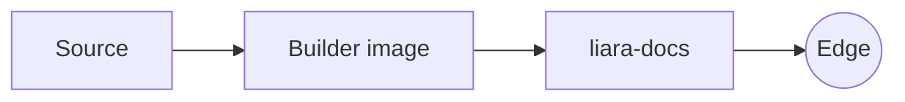

# Authoring a module's documentation

This is the practical companion to [The documentation pipeline](./documentation-pipeline.md):
how to wire up documentation for a module so the shared toolchain picks it up.
A module can ship a user guide (mdBook), an API reference (Doxygen), or both.

## What the builder looks for

When the builder image runs against your repository, it reacts to a handful of
files at the repo root:

| File | Purpose | Required |
| --- | --- | --- |
| `manifest.json` | Declares the module, its versions, and `latest` | **Yes** |
| `book.toml` + `docs/` | mdBook user guide | Optional |
| `Doxyfile` + headers | Doxygen API reference | Optional |
| `*.liaradoc.json` | Extra resources / placeholder replacements | Optional |

Most modules ship both a book and a Doxygen reference; the hosting layer
tolerates a module that has only one of the two.

## 1. The manifest (required)

`manifest.json` drives the version selector and the `/<repo>/latest/`
redirect. Two schema versions are supported; the navbar detects which one
it's reading from the presence of `manifest_version`. **New modules should
use v2** — v1 remains fully supported for modules that haven't migrated yet,
and there is no deadline to do so.

### v2 (recommended)

Validated against `module-manifest-v2.schema.json`. Strict
(`additionalProperties` is off everywhere):

```json
{
  "$schema": "https://liara-engine.github.io/liara/schemas/module-manifest-v2.schema.json",
  "manifest_version": 2,
  "kind": "contract",
  "metadata": {
    "name": "Liara Interfaces",
    "description": "The C ABI contracts shared by every module.",
    "repo": "liara-interfaces",
    "latest": "1.0.0"
  },
  "versions": {
    "dev":   {},
    "1.0.0": { "note": "First stable ABI" }
  }
}
```

* `manifest_version` must be `2` — this is what distinguishes it from v1.
* `kind` says what the repository *is*, and determines how its versions
  relate to the ABI:
  * `contract` — this repo's versions **are** ABI versions (e.g.
    `liara-interfaces`). Its `versions` entries carry no `abi`, only an
    optional `note`.
  * `module` / `host` — this repo targets one or more ABI versions. Each
    `versions` entry requires `abi`: either a bare version
    (`"abi": "1.0.0"`) or an array of anchors (`"abi": ["1.0.0", "2.0.0"]`)
    when the version is deliberately built against more than one ABI major.
  * `infrastructure` — no ABI relation at all (e.g. this repository,
    `docs-shared`). Like `contract`, its `versions` entries carry no `abi`.
* `metadata.repo` is the GitHub repository name (matches the module's entry
  in the central `modules-registry.json`).
* `metadata.latest` is the version the `latest` alias resolves to. Update it
  when you cut a release.
* Each `versions` entry may carry a short `note` (e.g. `"LTS"`,
  `"security fixes only"`) — the navbar shows it under the version in the
  dropdown and in its tooltip.
* A v2 manifest's `kind` takes precedence over the module's `is_abi`/`meta`
  flags in `modules-registry.json`, so once a module ships a v2 manifest
  those registry flags become informational only for it.
* Optional `artifacts` — for a repository that publishes something with its
  own, independent version line (different from the repo's own releases).
  Most modules don't need this; see the schema for the shape.

### v1 (still supported)

Validated against `module-manifest.schema.json`. No `manifest_version` or
`kind` field — the module's ABI role instead comes from
`modules-registry.json`'s `is_abi`/`meta` flags.

```json
{
  "$schema": "https://liara-engine.github.io/liara/schemas/module-manifest.schema.json",
  "metadata": {
    "name": "Liara Interfaces",
    "description": "The C ABI contracts shared by every module.",
    "latest": "1.0.0"
  },
  "versions": {
    "dev":   { "abi_compatibility": ["dev"] },
    "1.0.0": { "abi_compatibility": ["dev"] }
  }
}
```

* `metadata.latest` is the version the `latest` alias resolves to.
* `abi_compatibility` lists the ABI versions it is compatible with — the
  navbar uses this to show compatibility badges across modules.

In both versions, each key in `versions` must be `dev` or a `x.y.z` string.

## 2. The user guide (mdBook)

Add a `book.toml` and a `docs/` folder. The standard configuration — point the
theme at the shared one and leave the rest as below:

```toml
[book]
title = "Liara Interfaces"
authors = ["Liara Engine contributors"]
language = "en"
src = "docs"

[output.html]
hash-files = false
default-theme = "light"
preferred-dark-theme = "navy"
git-repository-url = "https://github.com/liara-engine/liara-interfaces"
git-repository-icon = "fa-github"

theme = "docs-shared/mdbook/theme"

[output.html.fold]
enable = true
level = 1

[output.html.search]
enable = true
limit-results = 30
use-boolean-and = true
boost-title = 2
boost-hierarchy = 2
boost-paragraph = 1
expand = true
heading-split-level = 2

# Optional: if you want to use Mermaid diagrams, add the preprocessor
[preprocessor.mermaid]
command = "mdbook-mermaid"
```

The `theme = "docs-shared/mdbook/theme"` line is the important one: the builder
stages the shared theme there before running mdBook, so your pages get the
Liara navbar, design tokens, and syntax highlighting automatically.

### Pages and the table of contents

You do **not** need to write a `SUMMARY.md`. If one is absent, the builder
generates it from your `docs/` tree: `README.md` becomes the section landing
page, and the remaining files follow. So a minimal guide is just:

```
docs/
├── README.md          # the section's front page
├── getting-started.md
└── concepts/
    ├── README.md      # "Concepts" landing page
    └── ecs.md
```

If you want full control over ordering, commit your own `SUMMARY.md` and it will
be used as-is.

### What you can write

Standard CommonMark plus mdBook extensions: headings, tables, footnotes, task
lists, callouts via blockquotes, and fenced code blocks. The theme bundles
custom Highlight.js grammars, so **C++**, **GLSL**, and **Dockerfile** all
colour correctly — prefer them over plain blocks.

Diagrams are available through the Mermaid preprocessor: use a fenced block with
the `mermaid` language and it renders as an SVG that follows the light/dark
theme. Prefer this over ASCII art for anything non-trivial.

````markdown

````

## 3. The API reference (Doxygen)

Add a `Doxyfile` and point `INPUT` at your headers. The standard configuration
wires the shared Doxygen template via `HTML_HEADER` / `HTML_FOOTER`:

```ini
PROJECT_NAME           = "Liara Interfaces"
PROJECT_BRIEF          = "The C ABI contracts shared by every module"
PROJECT_ICON           = docs-shared/shared-content/assets/logo.svg
OUTPUT_DIRECTORY       = build/doxygen

INPUT                  = include
RECURSIVE              = YES

EXTRACT_ALL            = YES
EXTRACT_PRIVATE        = YES
EXTRACT_STATIC         = YES
BUILTIN_STL_SUPPORT    = YES
MARKDOWN_SUPPORT       = YES

GENERATE_HTML          = YES
GENERATE_LATEX         = NO
GENERATE_TREEVIEW      = YES
FULL_SIDEBAR           = YES

HTML_HEADER            = docs-shared/doxygen/header.html
HTML_FOOTER            = docs-shared/doxygen/footer.html

# Project-specific aliases live here. For example, a thread-safety section:
ALIASES               += "threadsafety=<dl class='section threadsafety'><dt>Thread Safety</dt><dd>"
ALIASES               += "endthreadsafety=</dd></dl>"
```

`OUTPUT_DIRECTORY` is overridden by the builder at runtime, and the generated
HTML is published under `/<repo>/<version>/doxygen/`. Keep `HTML_HEADER` and
`HTML_FOOTER` pointed at `docs-shared/doxygen/` — that is what injects the shared
navbar and styling into every API page.

### Documenting headers

Use Javadoc-style comments. The template renders groups, classes, templates,
enums, parameter tables, and the standard admonitions (`@note`, `@warning`,
`@deprecated`). A small example:

```cpp
/**
 * @brief Appends an element, overwriting the oldest if full.
 * @param value The element to store.
 * @return @c true if an element was overwritten.
 * @threadsafety Not safe for concurrent writers.@endthreadsafety
 */
bool push(const T& value) noexcept;
```

Custom aliases like `@threadsafety` (defined in your `Doxyfile`) let you add
project-specific sections without touching the shared template.

## 4. Extra resources and replacements (optional)

If a page needs extra CSS/JS, a favicon, or build-time text substitutions,
declare a `*.liaradoc.json` (validated against `documentation-module.schema.json`).
Each entry either copies a **resource** into the output or performs a
**replacement** of a placeholder in the generated HTML. Most modules never need
this — it exists for the hub and the shared content themselves.

## 5. Testing before you merge

There is no separate local build to babysit. Open a pull request and, when your
documentation files change, a preview is published to a hidden URL
(`/<repo>/pr-<n>/`) and posted as a comment on the PR. Add the `docs-preview`
label to force a build if the path filter didn't catch your change. The preview
is rebuilt on every push and removed when the PR closes — see
[The documentation pipeline](./documentation-pipeline.md#8-pr-previews).

## Checklist for a new module

1. Add `manifest.json` with `metadata.latest` and at least a `dev` version.
2. Add `book.toml` + `docs/README.md` for the guide (theme pointed at
   `docs-shared/mdbook/theme`).
3. Optionally add `Doxyfile` + `include/` for the API reference.
4. Add the module to the central `modules-registry.json` so the navbar lists it.
5. Open a PR and check the preview.