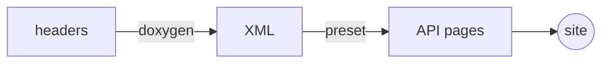

import { Aside, Badge, Card, CardGrid, FileTree, LinkCard, Steps, TabItem, Tabs } from '@astrojs/starlight/components';

This is the practical companion to
[The documentation pipeline](../documentation-pipeline/): how to wire up
documentation for a module so the shared toolchain picks it up, and what you
can write once it does.

A module can ship a prose guide, a generated API reference, or both. Nothing
below requires you to know anything about Astro.

## 1. What the builder looks for

<FileTree>
- your-module/
  - manifest.json **required — the module, its versions, and `latest`**
  - README.md published under *About*
  - CHANGELOG.md published under *About*
  - LICENSE published under *About*
  - docs/ your prose guide, one file per page
    - index.mdx the section's front page
    - getting-started.md
    - concepts/
      - index.md
      - ecs.md
  - Doxyfile optional — enables the API reference
  - include/ the headers it is generated from
  - astro.config.mjs optional — rarely needed, see §5.2
</FileTree>

Everything except `manifest.json` is optional. In practice every module has a
guide; modules with a public C or C++ surface also have an API reference.

<Aside type="tip">
There is no `SUMMARY.md`, no `book.toml`, and no theme path to point anywhere.
The sidebar is generated from the directory tree, and ordering is controlled
per page with `sidebar.order` in the front matter.
</Aside>

## 2. The manifest <Badge text="required" variant="danger" />

`manifest.json` drives the version selector, the compatibility badges, and the
`/<repo>/latest/` redirect. Two schema versions are supported side by side;
the navbar detects which one it is reading from the presence of
`manifest_version`.

<Tabs syncKey="manifest">
<TabItem label="v2 — recommended">

Validated against `module-manifest-v2.schema.json`. Strict —
`additionalProperties` is off everywhere.

```json title="manifest.json"
{
  "$schema": "https://liara-engine.github.io/liara/schemas/module-manifest-v2.schema.json",
  "manifest_version": 2,
  "kind": "contract",
  "metadata": {
    "name": "Liara Interfaces",
    "description": "The C ABI contracts shared by every module.",
    "repo": "liara-interfaces",
    "latest": "1.0.0"
  },
  "versions": {
    "dev":   {},
    "1.0.0": { "note": "First stable ABI" }
  }
}
```

`kind` says what the repository *is*, and determines how its versions relate
to the ABI:

| `kind` | Meaning | `versions` entries |
| --- | --- | --- |
| `contract` | This repository's versions **are** ABI versions | no `abi`, optional `note` |
| `module` / `host` | Targets one or more ABI versions | `abi` required |
| `infrastructure` | No ABI relation at all | no `abi`, optional `note` |

An `abi` is either a bare version (`"abi": "1.0.0"`) or an array of anchors
(`"abi": ["1.0.0", "2.0.0"]`) when a version is deliberately built against
more than one ABI major.

Other fields worth knowing:

- `metadata.repo` is the GitHub repository name, and must match the module's
  entry in `modules-registry.json`.
- `metadata.latest` is the version `latest` resolves to. Update it when you
  cut a release.
- A version's `note` (`"LTS"`, `"security fixes only"`) is shown under it in
  the version dropdown.
- `kind` takes precedence over the module's `is_abi` / `meta` flags in the
  registry, which become informational once a module ships a v2 manifest.

</TabItem>
<TabItem label="v1 — still supported">

Validated against `module-manifest.schema.json`. No `manifest_version` or
`kind`; the module's ABI role comes from `modules-registry.json` instead.

```json title="manifest.json"
{
  "$schema": "https://liara-engine.github.io/liara/schemas/module-manifest.schema.json",
  "metadata": {
    "name": "Liara Interfaces",
    "description": "The C ABI contracts shared by every module.",
    "latest": "1.0.0"
  },
  "versions": {
    "dev":   { "abi_compatibility": ["dev"] },
    "1.0.0": { "abi_compatibility": ["dev"] }
  }
}
```

`abi_compatibility` lists the ABI versions the entry is compatible with,
judged by the same rule as the ABI's own `liara_version_provides()`: same
`major.minor` is compatible, an older minor is degraded, a different major is
a mismatch.

Only major-level precision — or minor-level, for a `0.x` ABI — is meaningful.
Declaring `"0.2.0"` means every `0.2.x` release is compatible. Declaring
`"0.2.1"` additionally marks `0.2.0` as degraded rather than compatible.

<Aside type="note">
v1 is fully supported and there is no deadline to migrate. New modules should
still use v2 — it is stricter, it carries `kind`, and it can annotate a
version.
</Aside>

</TabItem>
</Tabs>

In both versions, every key in `versions` must be `dev` or an `x.y.z` string.

## 3. The prose guide

Put one file per page in `docs/`. `index.md` or `index.mdx` becomes the
section's front page; the rest follow. Nested directories become nested
sidebar groups.

Every page needs front matter:

```yaml title="docs/getting-started.md"
---
title: Getting started
description: Install the module, build the sample, and render your first frame.
sidebar:
  order: 1
---
```

Only `title` is required — the build adds a minimal block if you forget — but
`description` is what search results and social cards show, so write it.

<Aside type="caution" title="Choosing between .md and .mdx">
Plain `.md` gives you Markdown, asides, code frames and Mermaid — enough for
most pages. The components in §4.2 (tabs, steps, cards, file trees) are JSX
and need `.mdx`.

Renaming a page from `.md` to `.mdx` does not change its URL.
</Aside>

## 4. What you can write

Everything below is rendered by this very page, so if it looks right here it
will look right in your module.

### 4.1 Asides

Four types, in Markdown or MDX. The directive form works in both:

```md
:::note
Useful to know, but not urgent.
:::

:::tip[Do it this way]
An aside can carry its own title in brackets.
:::

:::caution
Something that will bite you later.
:::

:::danger
Something that will bite you now.
:::
```

:::note
Useful to know, but not urgent.
:::

:::tip[Do it this way]
An aside can carry its own title in brackets.
:::

:::caution
Something that will bite you later.
:::

:::danger
Something that will bite you now.
:::

### 4.2 Components

In an `.mdx` page, import what you need from
`@astrojs/starlight/components`:

```jsx
import { Aside, Badge, Card, CardGrid, FileTree, LinkCard, Steps, Tabs, TabItem } from '@astrojs/starlight/components';
```

<Tabs>
<TabItem label="Steps">

Numbered sequences that read as a procedure rather than as a list. Wrap an
ordinary ordered list:

<Steps>

1. Write the manifest.

2. Write a page.

3. Open a pull request and read the preview.

</Steps>

</TabItem>
<TabItem label="Cards">

`CardGrid` for a set of peers, `LinkCard` when each one goes somewhere:

<CardGrid>
	<Card title="Guide" icon="open-book">
		Hand-written prose. Lives in `docs/`.
	</Card>
	<Card title="API reference" icon="puzzle">
		Generated from headers. Cannot drift from the code.
	</Card>
</CardGrid>

</TabItem>
<TabItem label="File trees">

For repository layouts, where indentation alone stops being readable:

<FileTree>
- include/
  - liara/
    - **version.h** the one header every module includes
    - result.h
- src/
</FileTree>

</TabItem>
<TabItem label="Badges">

<Badge text="stable" variant="success" /> <Badge text="experimental" variant="caution" /> <Badge text="removed" variant="danger" /> — inline, for statuses that would otherwise cost a sentence.

</TabItem>
</Tabs>

Tabs can be synchronised across a page: give every group the same `syncKey`
and choosing a tab in one switches all of them. The manifest section above
uses it.

### 4.3 Code

Code fences go through Expressive Code, so a fence can carry a title, a frame,
line markers and diff markers:

````md
```cpp title="include/liara/ring_buffer.hpp" {4-6} ins={8}
```
````

```cpp title="include/liara/ring_buffer.hpp" {4-6} ins={8}
template <typename T, std::size_t N>
class RingBuffer {
public:
    /// Appends an element, overwriting the oldest if full.
    /// @return true if an element was overwritten.
    bool push(const T& value) noexcept;

    [[nodiscard]] bool empty() const noexcept { return size_ == 0; }
};
```

A fence with `frame="terminal"` is rendered as a terminal window instead of a
file:

```bash frame="terminal"
docker run --rm -v "$PWD:/src" \
  ghcr.io/liara-engine/liara-documentation-builder:latest --output /src/generated-docs
```

C, C++, GLSL, Dockerfile, TOML, JSON, YAML and the rest of Shiki's grammars
are all available — prefer a tagged fence over a bare one.

### 4.4 Diagrams

A `mermaid` fence renders as an SVG that follows the light/dark theme. Prefer
it over ASCII art for anything non-trivial.



### 4.5 The rest of Markdown

Tables, footnotes[^1], task lists, `inline code`, **bold**, *italic*,
~~strikethrough~~, and inline HTML such as <kbd>Ctrl</kbd> + <kbd>K</kbd> all
work as you would expect.

[^1]: Footnotes included.

## 5. The API reference

Add a `Doxyfile` and point `INPUT` at your headers. The builder overrides the
output settings at run time, so the only things that matter are what to read
and how to read it:

```ini title="Doxyfile"
PROJECT_NAME           = "Liara Interfaces"
PROJECT_BRIEF          = "The C ABI contracts shared by every module"

INPUT                  = include
RECURSIVE              = YES

EXTRACT_ALL            = YES
EXTRACT_STATIC         = YES
BUILTIN_STL_SUPPORT    = YES
MARKDOWN_SUPPORT       = YES

# Project-specific sections. This one renders as a "Thread Safety" block.
ALIASES               += "threadsafety=<dl class='section threadsafety'><dt>Thread Safety</dt><dd>"
ALIASES               += "endthreadsafety=</dd></dl>"
```

<Aside type="note" title="What the builder overrides">
`GENERATE_XML`, `GENERATE_HTML`, `GENERATE_LATEX`, `XML_PROGRAMLISTING`,
`OUTPUT_DIRECTORY`, `XML_OUTPUT`, `INPUT` and `QUIET` are all set by
`build-docs`. There is no `HTML_HEADER` or `HTML_FOOTER` to wire up any more —
Doxygen no longer generates HTML at all. Its XML is read by the preset and
rendered as ordinary Starlight pages.

Three more are set for reasons the preset depends on. `INTERNAL_DOCS = YES`
keeps `@internal` markers in the XML so the generator can act on them instead
of finding them already stripped; `SORT_MEMBER_DOCS = NO` and
`SORT_BRIEF_DOCS = NO` keep declaration order, because a struct's field order
is its memory layout and a header's function order is how you grouped them.
The preset groups members by kind itself and leaves each group as written.

`build-docs` also *clears* `HTML_HEADER`, `HTML_FOOTER`, `HTML_STYLESHEET`,
`HTML_EXTRA_STYLESHEET`, `HTML_EXTRA_FILES`, `LAYOUT_FILE` and the `LATEX_*`
equivalents, so a Doxyfile still pointing at the retired shared theme builds
here unchanged. Doxygen checks those paths exist while it reads the
configuration — before it reaches `GENERATE_HTML = NO` — and exits if they do
not, which is what used to stop a rebuild of an old release. You do not need
to edit an old Doxyfile to bring its version over; deleting the dead tags is
tidier, not required.
</Aside>

### 5.1 Documenting headers

Javadoc-style comments. Everything below renders, and renders in a fixed
place on the page — you cannot get the order wrong:

```c title="include/liara/channel.h"
/**
 * @brief Opens a preview channel.
 *
 * @param[out] channel Receives the opened channel. Never written on failure.
 * @param[in]  id      Channel index, below @ref LIARA_MAX_CHANNELS.
 *
 * @return A status code.
 * @retval LIARA_OK     The channel is open and owned by the caller.
 * @retval LIARA_EINVAL @p id is out of range.
 *
 * @pre  The subsystem has been initialised.
 * @post On success, the caller owns @p channel until it closes it.
 * @note Opening a channel does not allocate.
 * @since 0.1.0
 * @see liara_close
 *
 * @threadsafety Safe from any thread. @endthreadsafety
 */
liara_status liara_open(struct liara_channel *channel, unsigned id);
```

`@param`, `@retval`, `@exception` and `@tparam` become tables under their own
headings — **Parameters**, **Returns**, **Throws** — with the real parameter
types taken from the declaration and every type name that resolves to a
documented symbol turned into a link.

`@note`, `@warning` and `@attention` become Starlight callouts. Everything
else Doxygen calls a section — `@pre`, `@post`, `@invariant`, `@since`,
`@see`, `@remark`, `@deprecated`, `@todo`, `@bug`, `@par` — becomes a labelled
block where you wrote it, coloured by what it promises.

<Aside type="tip" title="Project-specific sections">
Two spellings, one result. `@par Thread safety:` is Doxygen's own and needs no
setup. An alias expanding to raw HTML —

```ini
ALIASES += "threadsafety=<dl class='section threadsafety'><dt>Thread Safety</dt><dd>"
ALIASES += "endthreadsafety=</dd></dl>"
```

— is what every Liara module already carries, and Doxygen parses it back into
a variable list. Both arrive at the generator as the same thing and come out
as the same labelled block. There is nothing to change in an existing
Doxyfile.
</Aside>

### 5.2 Keeping things out of the reference

`EXTRACT_ALL` means Doxygen reports everything, including things that were
never part of your surface. Most of them are removed for you: the header CMake
generates to hold an export macro, anything under `detail/`, `internal/` or
`impl/`, the `std` namespace an include dragged in, and the macro invocations
at file scope — a `LIARA_STATIC_ASSERT(…)` line — that Doxygen reads as
function declarations.

For anything else, mark it in the code:

```c title="include/liara/scratch.h"
/**
 * @file scratch.h
 * @brief Allocation scratch space.
 * @internal Implementation detail; not part of the ABI.
 */
```

`@internal` in a file's own doc block keeps the whole header out; on a single
symbol it keeps that symbol out. Prefer it to a pattern in a Doxyfile: it
travels with the code, so the header can be renamed or moved without anyone
remembering to update a list somewhere else. `EXCLUDE_PATTERNS` in your
Doxyfile still works and is the right tool for a whole directory that has no
doc comments to mark.

<Aside type="note" title="Undocumented is not hidden">
A public symbol with no doc comment still appears — name and declaration only,
in a collapsed **Also declared here** list at the foot of its page. It is part
of your surface, so hiding it would misrepresent the module; it says nothing,
so it does not get a card. If a whole header has nothing documented in it and
no `@file` description, it gets no page at all.
</Aside>

### 5.3 Choosing a layout

The loader supports two layouts. `file` gives one page per header, and it is
what every module is built with today: a C header is a coherent unit, and the
page stays short enough to scan. `symbol` gives one page per symbol, for a C++
surface large enough that a per-header page becomes a wall — at roughly two
and a half times the page count.

<Aside type="caution" title="Not selectable per module yet">
The layout is chosen in the preset's own `src/content.config.ts`, which is
baked into the builder image; a module repository cannot override it, because
only `astro.config.mjs` is copied out of the module. Switching a module to
`symbol` means a change in `docs-shared`. If you need it, say so — the hook is
one line, it just has no consumer yet.
</Aside>

## 6. Testing before you merge

There is no local build to babysit, and that is on purpose — reproducing the
full toolchain locally is more error-prone than running the real one on a
hidden URL.

<Steps>

1. Open a pull request. When documentation files change, a preview is built
   and published to `/<repo>/pr-<n>/`.

2. The URL is posted as a sticky comment on the pull request, and rebuilt on
   every push.

3. If the path filter did not catch your change, add the `docs-preview` label
   to force a build.

4. The preview disappears when the pull request closes.

</Steps>

A preview is the one kind of build that carries its own search index, so you
can search the pages you just wrote — see [Search](../search/).

## Checklist for a new module

<Steps>

1. Add `manifest.json` with `metadata.latest` and at least a `dev` version.

2. Add `docs/index.md` — one page is enough to start.

3. Optionally add `Doxyfile` and `include/` for the API reference.

4. Add the module to `modules-registry.json` in `docs-shared`, so the navbar
   lists it.

5. Add the CI caller
   ([CI and deployment](../ci-and-deployment/#2-who-runs-what)).

6. Open a pull request and read the preview.

</Steps>

<LinkCard
	title="The documentation pipeline"
	href="../documentation-pipeline/"
	description="What happens to those files after you push them."
/>
