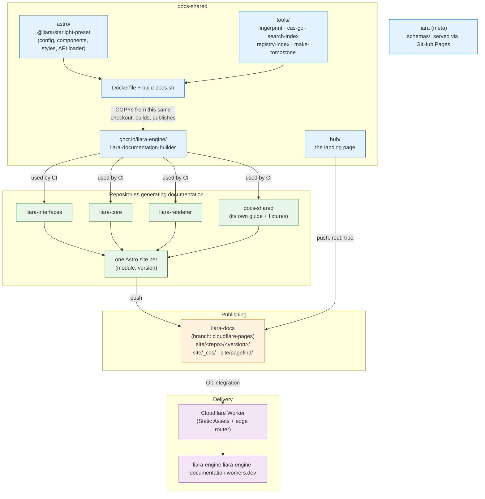
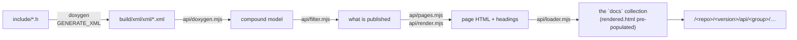

import { Aside, Code, FileTree, LinkCard, Steps, TabItem, Tabs } from '@astrojs/starlight/components';

The documentation is not built in one place. The shared look and behaviour
live in this repository, the build logic lives in a container image built
*from* this repository, each module builds its own site from its own sources,
and everything is published to a single hosting repository served at the edge.

This page is the map of that. If you are touching the preset, the builder, or
the site tools, start here.

## 1. The big picture



The mental model that makes the rest click: **almost everything in this
repository is baked into the builder image.** The preset, the styles, the
fonts, the build script and the site tools all ship inside it. There is no
runtime bundle a page fetches from the site any more, and no version pin to
keep in step by hand — the image built from a commit bakes in *that commit's*
preset. The consequence is that "the templates changed" and "the image
changed" are the same event, which is why one workflow does both
([CI and deployment](../ci-and-deployment/#3-why-the-image-and-the-docs-are-one-workflow)).

## 2. The repositories and their roles

| Repository | Role |
| --- | --- |
| `docs-shared` | The Astro preset, the design tokens and fonts, the Doxygen-to-Starlight loader, the site tools, the hub page — **and the builder image itself**. Changing how documentation *looks* or is *built* happens here. |
| `liara` (meta) | Hosts the JSON `schemas/`, served via GitHub Pages (§6). Also has its own documentation, like any other module. |
| `.github` | Org-level **reusable workflows**: build, deploy, previews, cleanup, image build. Module repositories call these. |
| `liara-docs` | The hosting repository. Every published site lives on its `cloudflare-pages` branch under `site/`. Also holds the Cloudflare Worker (`wrangler.jsonc` + `src/index.js`) and the scheduled preview sweep. |
| Module repositories | Each owns its sources — `manifest.json`, `docs/`, `Doxyfile`, headers — and a thin CI caller. |

## 3. Anatomy of docs-shared

<FileTree>
- astro/ **the shared Starlight preset — `@liara/starlight-preset`**
  - index.mjs the `liaraDocs()` config factory (§4)
  - api/ Doxygen XML → Starlight pages (§5)
    - loader.mjs the content-layer loader
    - pages.mjs the page model, `file` and `symbol` layouts
    - groups.mjs how the reference divides into sections
    - doxygen.mjs XML → HTML, without Markdown in between
    - highlight.mjs Shiki over the Liara code tokens
  - components/
    - LiaraSelect.astro the dropdown every switcher is built from
    - ModuleSwitchers.astro the module and version switchers
    - SiteTitle.astro the site title, the home button and the switchers
    - PageTitle.astro the breadcrumb trail; the heading, except on a splash page
    - Sidebar.astro the navigation, under the module and version it is for
    - ReadingPreferences.astro the two preferences, in Starlight's one slot
    - ThemeSelect.astro light / dark / auto, on both surfaces
    - AccessibilityToggle.astro the dyslexia-friendly mode, on both surfaces
    - Head.astro restores that mode before the first paint
    - MobileMenuFooter.astro where the switchers go once the header is too narrow
    - VersionBanner.astro the dev / preview / old-release notice
    - Search.astro points Pagefind at the site-wide index
  - styles/ tokens.css, theme.css, fonts.css, hub.css, and the fonts
  - src/ what a module build is assembled *into*
    - content.config.ts composes the prose and API loaders
    - pages/index.astro the per-module landing page
  - scripts/generate-config.mjs writes an `astro.config.mjs` when a module ships none
- hub/ the site's landing page — a small standalone Astro site
- tools/ the site tools, run outside the Astro build (§7)
- tests/fixtures/ a synthetic module, built by every pull request
- docs/ **the source of the guide you are reading**
- Dockerfile the builder image
- build-docs.sh its entry point
- modules-registry.json module identities, published to the site root
- manifest.json this repository's own module manifest
</FileTree>

<Aside type="tip" title="Everything here is shared, all at once">
There is no longer a baked/runtime split. A change to `astro/styles/` reaches
a reader only after the image is rebuilt *and* the sites are rebuilt with it —
which the release workflow does automatically for `dev` and `latest` of every
module. Older releases keep the look they were built with until somebody
rebuilds them on purpose.
</Aside>

## 4. The preset

`astro/index.mjs` exports one function, `liaraDocs()`. A module's entire Astro
configuration reduces to what is genuinely specific to that module:

```js title="astro.config.mjs"
import { defineConfig } from 'astro/config';
import starlight from '@astrojs/starlight';
import { liaraDocs } from '@liara/starlight-preset';

export default defineConfig(liaraDocs({
    starlight,
    repo: 'liara-interfaces',
    title: 'Liara Interfaces',
    description: 'The C ABI contracts shared by every module.',
}));
```

Most modules do not even write that file: if the repository root has no
`astro.config.mjs`, `scripts/generate-config.mjs` generates the equivalent
from `manifest.json` before the build. Committing one is the escape hatch, not
the norm.

Everything a reader would recognise as "the Liara look" is decided inside
`liaraDocs()` — the sidebar shape, the component overrides, the design tokens,
the social and edit links, Mermaid, and the deployment path.

### 4.1 The deployment path is environment, not configuration

A built Astro site is not relocatable: `base` is baked into every emitted URL.
The deploy path therefore has to be known at build time, and it comes from the
environment rather than from a tracked file, so that one commit can be built
as a release, as a dev snapshot, or as a pull request preview without editing
anything:

| Variable | Meaning |
| --- | --- |
| `LIARA_DOCS_REPO` | Repository name, and the first URL segment |
| `LIARA_DOCS_VERSION` | Version segment: `dev`, `1.2.3`, `pr-42` |
| `LIARA_DOCS_SITE` | Origin of the deployed site |
| `LIARA_DOCS_API` | Whether this module ships an API reference |
| `LIARA_ASSETS_PREFIX` | Root path of the content-addressed store (§7.1) |

`LIARA_DOCS_VERSION` does more than name a directory. It decides which version
banner a page carries, and — because a preview's pages are deployed nowhere
else — whether the site builds a search index of its own or queries the
site-wide one ([Search](../search/)).

The defaults make `npm run dev` work with no environment at all.

## 5. From headers to API pages

The API reference is generated from Doxygen's **XML**, not its HTML, and lands
in the same Starlight content collection as the prose. That is the whole point:
the API section is a section of the site rather than a neighbour of it — same
layout, same sidebar, same theme, same search.



Five decisions in there are worth knowing about, because they are not
obvious and they are load-bearing:

<Steps>

1. **No Markdown or MDX in between.** Doc comments are full of `<`, `{` and
   `>` — type names, template parameters, comparisons — and all three are
   syntax in MDX. Escaping them correctly means escaping them everywhere,
   forever, and one miss is a build failure on a page nobody touched.
   `api/doxygen.mjs` emits HTML directly and hands it to Astro's content layer
   as pre-rendered output, which deletes the entire class of problem.

2. **Anchors are never Doxygen's own identifiers.** A refid like
   `liara__version_8h_1a8ac655b2…` is stable only until a signature changes, so
   a URL built from it would break on a refactor that changed nothing a reader
   can see. Slugs are derived from names, and disambiguated on collision.

3. **Cross-references are resolved last, not as they are read.** A `@ref` can
   name a symbol in a file that has not been parsed yet, one that is about to
   be filtered out, or a typedef about to be folded into the type it names —
   and an anchor is not final until every member of its compound is. So the
   renderer emits a placeholder and `resolveReferences` turns it into a link
   once nothing can change, or unwraps it back to plain code. Nothing in the
   API section links to a page that was never generated.

4. **Layout is chosen per module.** `split: 'file'` gives one page per header —
   right for a C surface, where the reader already thinks in terms of
   `liara_version.h`. `split: 'symbol'` gives one page per symbol, for a C++
   surface large enough that a per-header page becomes a wall. It costs
   roughly two and a half times the pages, so it is not the default.

5. **The group is a URL segment, not a label.** `api/groups.mjs` divides the
   reference into headers, namespaces, classes and the rest, and the loader
   files each page under its group's directory. That is what makes Starlight's
   autogenerated sidebar produce one titled section per kind instead of one
   alphabetical run of everything a module declares. `index.mjs` reads the same
   table to declare those sections — it has to name them before any page
   exists, so a module with no namespaces produces an empty group, which
   `styles/theme.css` hides.

</Steps>

### 5.1 What a page is made of

`api/render.mjs` builds every page out of the same parts, in the same order,
because a reference is read by someone looking for one symbol rather than
front to back:

| Part | What it is |
| --- | --- |
| Header band | A badge for the kind, and the path in the source tree, linked |
| Lead | The `@brief`, set apart from the prose that elaborates on it |
| `#include` | Recovered from the path — the one thing Doxygen never states |
| Synopsis | The whole compound on one screen, one row per symbol |
| Member cards | A bordered card per symbol, spined in the colour of its kind |
| Also declared | Undocumented symbols, collapsed at the foot of the page |

Inside a card the order never varies: badge and name, the declaration, the
prose, then **Parameters**, **Returns**, **Throws**, **Enumerators**, and last
the source location. `@param`, `@retval`, `@exception`, `@tparam` and
`@return` are *lifted* out of the description into those tables, so they are
always in the same place whatever order they were written in.

Everything else Doxygen calls a section — `@pre`, `@post`, `@since`, `@see`,
`@deprecated`, `@todo`, `@par`, and the variable lists a project's own
`ALIASES` expand into — stays where the author put it and is rendered as a
**labelled block**, coloured by what it promises: rose for a contract the
caller must honour, lavender for a section the project invented, blue for a
pointer elsewhere, red for a deprecation. Losing that label is what used to
make a precondition read as an ordinary sentence, and a `@threadsafety` block
indistinguishable from the paragraph above it.

A struct is the exception to the card layout: its fields are one table, and
the declaration is rebuilt above it from `type` + `name` + `args`, the way
Doxygen renders a declaration anywhere else — so arrays and function pointers,
where the name sits in the middle of the type, come out right. Field order is
declaration order, because for a C struct that order *is* the layout, which is
why `build-docs` switches `SORT_MEMBER_DOCS` off.

All of it is scoped to `.lapi` and styled by `astro/styles/api.css`. Starlight
puts its content styles in a cascade layer, so an unlayered one-class selector
there wins without having to out-specify anything — and nothing in that file
can reach a hand-written page.

Declarations and the code blocks inside doc comments are highlighted by Shiki,
using a theme whose colours are `var(--liara-code-*)` references rather than
literals — so light and dark switching is free and the project's own nine-role
code palette stays in use. Prose code fences go through Expressive Code, as
everywhere else in Starlight, which only ever sees Markdown. A signature wraps
rather than scrolls: it is the line the reader came for, and a C prototype
clipped at the edge of its card is the one thing on the page that must never
be half-visible.

### 5.2 What never reaches a page

Doxygen is asked to read everything (`EXTRACT_ALL`), because the alternative
is a reference that silently omits whatever nobody remembered to comment. The
cost is that it also reports things that were never part of the surface, and
`api/filter.mjs` is where they stop:

| Left out | Why it appears at all |
| --- | --- |
| `@internal` headers and symbols | The module said so — see below |
| `*_export.h`, `detail/`, `internal/`, `impl/` | Generated or conventionally private |
| Compounds with nothing documented in them | A page listing only undescribed symbols is the absence of a page |
| `std`, `__gnu_cxx`, `*::detail` | `BUILTIN_STL_SUPPORT` picked them up from an include |
| Anonymous compounds | Doxygen names them `@0123…` or `Parent::[union].field` |
| Macro invocations read as functions | A file-scope `LIARA_STATIC_ASSERT(…)` is a function with no return type, which C cannot declare |

Undocumented symbols are *not* in that list. They are part of the surface, so
hiding them would misrepresent the module; they carry no information, so
putting them among the documented ones buries what does. They are listed —
name and declaration only — in a collapsed disclosure at the foot of their
page, each row carrying its anchor so a cross-reference still lands on it.

`@internal` works because `build-docs` forces `INTERNAL_DOCS = YES`. Doxygen's
default is to strip everything after the marker while it writes the XML, which
means the loader never learns the header was marked at all. Keeping it in the
XML is what lets the filter act on it — and nothing marked internal is ever
rendered, so switching the tag on publishes nothing that was not published
before.

## 6. The builder image

`ghcr.io/liara-engine/liara-documentation-builder` is a Debian
`bookworm-slim` image carrying Doxygen and Node, plus this repository:

| Baked in | From | Lands at |
| --- | --- | --- |
| The Astro preset and its `node_modules` | `astro/` | `/working` |
| The site tools | `tools/` | `/opt/liara/tools` |
| The build script | `build-docs.sh` | `/usr/local/bin/build-docs` |
| The module registry | `modules-registry.json` | `/working/registry.json` |

It expects a module's sources mounted at `/src` and writes the built site to
`--output`. `build-docs` runs:

<Steps>

1. **Check.** Refuse to continue without a `manifest.json` at the repository
   root.

2. **Assemble.** Copy the module's `docs/` into `/working/src/content/docs/guides/`,
   and its `README.md`, `CHANGELOG.md` and `LICENSE` into `…/about/`. Copy the
   module's `astro.config.mjs` if it has one; otherwise one is generated.

3. **Extract the API surface.** If there is a `Doxyfile` and `--skip-api` was
   not passed, run Doxygen with `GENERATE_XML=YES` and `GENERATE_HTML=NO` into
   `/working/build/xml`, and fail if it produces no `index.xml`. The module's
   Doxyfile is inherited whole; every tag describing *output* is restated
   afterwards, and the theme tags of the retired toolchain (`HTML_HEADER` and
   friends) are cleared, because Doxygen validates their paths before it ever
   notices that HTML is switched off.

4. **Add front matter.** Any `.md` or `.mdx` page that does not start with
   `---` gets a minimal front matter block, titled after its file name.
   Authoring a real `title` and `description` is better; this only exists so
   that a stray file cannot fail the build.

5. **Build.** `npm run build` in `/working`.

6. **Resolve search.** A published version's own Pagefind bundle is discarded
   — the site-wide index covers it — while a preview keeps its own, minus the
   Pagefind UI bundles Starlight never fetches ([Search](../search/)).

7. **Fingerprint.** Relocate every asset into the content-addressed store and
   rewrite the references (§7.1).

8. **Hand over.** Copy the result to `--output`, with `manifest.json` beside
   it so the deploy knows what it just received.

</Steps>

### 6.1 Where the schemas come from

Validation resolves the URL in each file's `$schema` over HTTP, and those
schemas are served from GitHub Pages on the `liara` repository
(`https://liara-engine.github.io/liara/schemas/…`). It is the one piece of the
documentation infrastructure that did not move to Cloudflare, because the URL
is pinned as a `const` inside the schemas themselves and moving it would
invalidate every existing `manifest.json` at once.

<Aside type="caution">
Two consequences follow. A schema change takes effect only once Pages has
redeployed, not at the next build. And a build without network access cannot
validate.
</Aside>

## 7. The site tools

Everything in `tools/` operates on a *deployed site* rather than on a build.
They are deliberately dependency-free Python, runnable outside CI: point one
at a local checkout of `liara-docs` and it prints exactly what a workflow
would.

<Tabs>
<TabItem label="fingerprint.py">

Relocates a build's assets into the site-wide content-addressed store and
rewrites every reference to match. Runs at the end of every build.

```bash frame="terminal"
fingerprint.py --dist dist --base /liara-core/1.2.0
```

Astro already hashes its own output, but it writes it under the site's `base`,
so two versions producing byte-identical bundles still occupied two paths. The
preset points `build.assetsPrefix` at `/_cas/` and this pass moves the files to
where those URLs already say they are, then extends the same treatment to
anything copied verbatim from `public/`.

HTML is deliberately excluded: a page's URL is part of its meaning, and two
identical pages under two versions must both keep their own address.

</TabItem>
<TabItem label="cas-gc.py">

Collects store entries nothing points at any more. The counterpart of
`fingerprint.py`, which only ever adds.

```bash frame="terminal"
cas-gc.py site --dry-run
```

Three safety properties matter more here than anywhere else, because the
failure mode is silent — a wrongly deleted entry does not break the build, it
breaks a page nobody is looking at yet:

- it refuses to delete anything when it finds **no** references at all, since
  an empty result almost always means the site was not checked out;
- `--dry-run` and `--check` report without touching the tree;
- nothing is deleted the first time it is seen unreferenced. Reachability is
  computed from the committed tree, and a deploy in flight is not in it yet.
  Closing a pull request usually means merging it, so the preview teardown and
  the deploy that superseded it run at the same moment over byte-identical
  assets. An entry has to be seen unreferenced twice, `--grace-days` apart.

</TabItem>
<TabItem label="build-registry-index.py">

Joins `modules-registry.json` with every deployed module's `manifest.json`
into one `registry-index.json` at the site root.

```bash frame="terminal"
build-registry-index.py site --check
```

The navigation needs, for every module, its identity and its versions. A
browser assembling that for itself makes `1 + N` requests before the navbar
can be drawn, on every page view of every page. The output repository holds
all of those files at deploy time, so the join belongs there — and the navbar
then makes one request it can serve stale from cache.

It also flags retired versions, and annotates ABI compatibility using the
oracle published by `liara-interfaces` rather than reimplementing the rule.

</TabItem>
<TabItem label="search-index.py">

Builds the one Pagefind index the whole site shares, over `dev` and `latest`
of every module. See [Search](../search/).

```bash frame="terminal"
search-index.py site --dry-run
```

</TabItem>
<TabItem label="make-tombstone.py">

Retires one published version: replaces its pages with one page that says so
and names the version to read instead, and writes `removed.json` beside it.

```bash frame="terminal"
make-tombstone.py --site site --repo liara-core --version 0.1.4 \
                  --reason "Superseded by the 0.2 line."
```

Deleting the directory is the obvious way to reclaim the space and it is the
wrong one: every link into that version becomes a generic 404 that tells the
reader nothing about what happened. The marker is what the rest of the system
reads — the edge router answers deep links with a `410 Gone`, and the
navigation index shows `0.1.4 (retired)` rather than dropping an entry a
reader may be looking for.

</TabItem>
<TabItem label="site-audit.py">

Reports the three numbers that constrain the hosting layer: how many files the
site contains, how many are byte-identical duplicates, and how much of that a
content-addressed store could remove.

```bash frame="terminal"
site-audit.py site --max-files 20000
```

Exits non-zero when `--max-files` is exceeded, so the same invocation serves
as a CI gate.

</TabItem>
</Tabs>

### 7.1 Why a content-addressed store

Every version is deployed to its own directory and never rewritten
afterwards. That is deliberate — a published URL keeps working — and the cost
is that each directory would carry a full copy of the assets. The audit of the
live site put that duplication at 90% of its files, against a hosting layer
whose hard limit is a file count.

So assets do not live in the version directory. `fingerprint.py` moves them to
`/_cas/` keyed by content hash, and the deploy merges that into the site root;
nothing there is ever overwritten, because an identical name means identical
bytes. Two versions with identical fonts occupy one path, and a browser that
already fetched one version's stylesheet does not fetch it again for the next.

Search was the one thing this could not cover, and it is now handled a
different way — [Search](../search/) explains why.

## 8. Hosting

`liara-docs` is deployed via Cloudflare's Git integration as a **Workers
Static Assets** project. The `site/` directory is served directly; a small
Worker runs only when no static asset matches. It handles four things:

- **`latest`** — `/<repo>/latest/…` reads `metadata.latest` from the module's
  manifest and redirects to the concrete version. These redirects are
  `no-cache`, because `latest` moves.
- **Retired versions** — a deep link into a version with a `removed.json`
  beside it is answered with the tombstone page and a `410 Gone`.
- **Custom 404** — anything else unresolved is served `/404.html`.
- **Module root** — `/<repo>` alone resolves to `latest`.

### 8.1 URL surface

| URL | Result |
| --- | --- |
| `/` | The hub landing page |
| `/<repo>/<version>/` | That version's landing page |
| `/<repo>/<version>/guides/…` | Authored prose |
| `/<repo>/<version>/api/<group>/…` | Generated API reference, by kind |
| `/<repo>/<version>/about/…` | README, changelog, licence |
| `/<repo>/latest/…` | → the version the manifest names |
| `/<repo>` or `/<repo>/` | → latest |
| `/<repo>/pr-<n>/…` | A pull request preview |
| `/_cas/…` | The content-addressed asset store |
| `/pagefind/…` | The site-wide search index |
| `/modules-registry.json`, `/registry-index.json` | Navigation metadata |
| anything else | The custom 404 page |

## 9. Where to change what

| You want to change… | Edit… | Takes effect after… |
| --- | --- | --- |
| Colours, typography, spacing | `astro/styles/` | image rebuild + module rebuild |
| The navbar, switchers, banners | `astro/components/` | image rebuild + module rebuild |
| Sidebar shape, defaults, plugins | `astro/index.mjs` | image rebuild + module rebuild |
| API page layout or markup | `astro/api/` | image rebuild + module rebuild |
| Build steps | `build-docs.sh`, `Dockerfile` | image rebuild |
| Asset relocation, search, retirement | `tools/` | image rebuild, or the next deploy |
| The landing page | `hub/` | the hub workflow |
| The module list | `modules-registry.json` | the next deploy |
| Validation rules | `liara/schemas/` | next build, once Pages has redeployed |
| Redirects, 404, hosting | `liara-docs/src/index.js` | Git push |
| CI behaviour | `.github` reusable workflows | next workflow run |

Image rebuilds are automatic on every push to `main` and every release tag,
and a release also rebuilds `dev` and `latest` of every module — so "image
rebuild + module rebuild" is a wait, not a chore.

<LinkCard
	title="CI and deployment"
	href="../ci-and-deployment/"
	description="Which workflow does that, and how to trigger the ones that are manual."
/>
