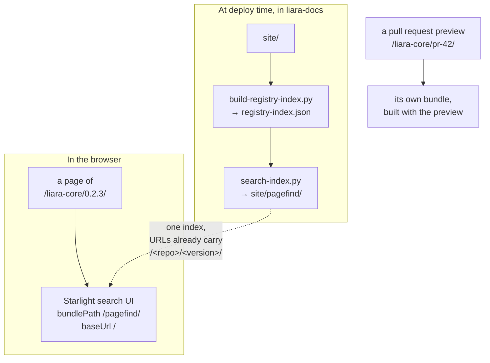

import { Aside, Badge, FileTree, LinkCard, Steps, TabItem, Tabs } from '@astrojs/starlight/components';

The site is searched by [Pagefind](https://pagefind.app), the static search
engine Starlight ships with. What is unusual here is *where* the index lives:
there is exactly one, at `/pagefind/`, shared by every published version of
every module. A version directory contains no search files at all.

This page explains why, and what follows from it.

## 1. The problem

Starlight builds one Pagefind bundle per site, and in this project every
version of every module **is** a site. A version directory therefore carried a
complete bundle: fourteen fixed files, plus one fragment per indexed page.

| Files | What | Varies per version? |
| --- | --- | --- |
| 7 | `pagefind-ui`, `pagefind-modular-ui`, `pagefind-component-ui`, `pagefind-highlight` | never fetched at all |
| 4 | `pagefind.js`, `pagefind-worker.js`, `wasm.en`, `wasm.unknown` | byte-identical everywhere |
| 2 | `pagefind-entry.json`, `pagefind.<hash>.pf_meta` | yes |
| 1+ | `index/*.pf_index` | yes |
| 1 per page | `fragment/*.pf_fragment` | yes |

Eleven of those fourteen are identical in every version — seven of them are
never fetched at all. Worse, it is the wrong shape: the cost grew with the number of versions
published rather than with the amount of documentation written. Every release
made search more expensive.

<Aside type="note" title="Why the content-addressed store could not fix it">
[`fingerprint.py`](../documentation-pipeline/#71-why-a-content-addressed-store)
shares every other asset on the site, and it skips `pagefind/` on purpose.
Pagefind resolves its runtime, its wasm, its index chunks and its fragments
against a single `basePath` computed at load time, so no part of a bundle can
be relocated without the rest following it. Splitting it would mean patching
Pagefind's own path resolution.
</Aside>

## 2. The shape now

One index, built at deploy time over the deployed site rather than over any
one build directory, covering `dev` and `latest` of every module.



The mechanism that makes this work is small. Pagefind stores each page's URL
in its fragment and prefixes it with `baseUrl` at query time. Because the
index is built over the site root, the stored URLs already read
`/liara-core/0.2.3/guides/…`, so `baseUrl` is `/` and nothing is prefixed onto
them. A page therefore does not need an index that knows where the page is.

The preset resolves both paths at build time and hands them to the search
component (`searchScope()` in `astro/index.mjs`).

<Aside type="tip" title="Why Starlight's Search component is vendored">
`bundlePath` and `baseUrl` are not reachable through Starlight's `pagefind`
configuration — it spreads that configuration *before* setting them.
`components.Search` is the override Starlight documents for exactly this, so
`astro/components/Search.astro` is a copy of the upstream component with those
two expressions changed and the provenance recorded at the top of the file.

Nothing else about that configuration is touched. Pagefind stays *enabled* for
every build, ranking weights included, and the per-version bundle is discarded
afterwards by `build-docs.sh` instead. Disabling Pagefind would have skipped
the indexing pass, but it would also have emptied the settings the search UI
reads — leaving a preview configured differently from a release, which is the
one thing a preview must never be.
</Aside>

### 2.1 Saying so

One index for every published version is not what a reader would assume from
the page they opened the search on. Searching from `0.1.4` and getting `latest`
back looks like a bug unless it is announced, so the modal says what it covers
before anyone types:

<Aside type="note" title="Searching dev and latest of every module.">
Older releases are not in here. They had their turn.
</Aside>

The first sentence is fixed and rendered at build time — it is the part that
has to be true at a glance. The remark after it rotates, picked from
`astro/components/search-scope-messages.js` in the same spirit as the version
banner and the 404 page, and the ⓘ beside it carries the full explanation for
anyone who wants to know why their old release is not searchable.

A preview says the other thing: *Searching this preview only.*

<Aside type="caution" title="Where the remark is picked">
Client-side, from a pool bundled into the shared search chunk — not inlined
into each page. A message baked into the HTML would differ per page and per
build, and the pages are exactly what the content-addressed store cannot
deduplicate.
</Aside>

### 2.2 Which module, which version

Announcing the scope covers the modal. It does not cover a *result*: a hit
could be in another module, or in `dev` when you are reading `latest`, and the
list said neither — so clicking one was a small leap of faith, and landing in
the wrong version of the right page is exactly the kind of thing nobody
notices until it has cost them an hour.

Every page therefore carries two Pagefind metadata fields, and the results
show them as tags:

```html
<span data-pagefind-meta="module[data-value]" data-value="Liara Core"></span>
<span data-pagefind-meta="version[data-value]" data-value="dev"></span>
```

They are emitted by `astro/components/VersionBanner.astro`, which is the
Banner slot — the first child of the `<main>` that Pagefind indexes, and the
one element rendered on every page including a splash one. The values come
from attributes rather than from the `key:value` list Pagefind also accepts,
because a module name is under no obligation to avoid a comma. The elements
are empty, so nothing of this reaches an excerpt.

<Aside type="tip" title="Two entries per page, on purpose">
The banner itself is `data-pagefind-ignore` partly so that an unchanged page
indexes identically in `dev` and in `latest`. These two fields deliberately
break that: the whole point is that the two entries are told apart. The index
covers exactly two versions per module, so the cost is bounded at one extra
fragment per page.
</Aside>

## 3. What is searchable

| From a page of… | Search covers | Why |
| --- | --- | --- |
| `latest` <Badge text="indexed" variant="success" /> | Every module's `dev` and `latest` | The documentation people actually read |
| `dev` <Badge text="indexed" variant="success" /> | Every module's `dev` and `latest` | Same index, same results |
| an older release <Badge text="not indexed" variant="caution" /> | Every module's `dev` and `latest` | See below |
| a pull request preview <Badge text="local" variant="note" /> | That preview only | Its pages exist nowhere else |
| a retired version <Badge text="excluded" variant="danger" /> | Every module's `dev` and `latest` | Its pages are gone; only a tombstone remains |

Two exclusions are deliberate:

**Older releases are readable but not searched.** A reader on one is already
being told by the version banner that it is not the version to trust, and a
search from it now answers with the current documentation — which is the
answer they want far more often than a hit inside a release they landed on by
accident. Nothing about those pages changes: they keep their URLs, their
links, and their place in the version selector.

**Previews search themselves.** The site-wide index is built from what is
deployed, and a preview's pages are, by construction, not deployed anywhere
else. Since reading the pages you just wrote is most of the point of a
preview, a `pr-*` build keeps a local bundle — minus the seven UI files
Starlight never fetches. It is transient and the preview teardown removes it
with everything else.

## 4. Operating it

<Tabs>
<TabItem label="Rebuilding the index">

`tools/search-index.py` runs against a deployed site, after
`build-registry-index.py` — it reads the index that script writes to decide
what to cover.

```bash frame="terminal"
python3 tools/search-index.py site
```

```ansi frame="none"
  Search index
    Indexed                   3 version(s), 23 page(s)
    Wrote                    30 files into /pagefind/
    Pruned                    7 unfetched UI files
    Covered:
      docs-shared/dev                          (dev)
      docs-shared/1.0.0                        (latest)
      liara-core/dev                           (dev)
    Not covered:
      liara-core/2.0.0 (retired)
```

The bundle is rebuilt, never updated: leaving the previous run's files in
place would keep fragments for pages that no longer exist.

</TabItem>
<TabItem label="Checking a selection">

`--dry-run` reports what would be covered and writes nothing — useful when a
module has just been added, or when a version's absence from search is
suspicious.

```bash frame="terminal"
python3 tools/search-index.py site --dry-run
```

A version can be missing from the selection for exactly three reasons, and
the report names which: it is retired, it is declared in a manifest but was
never built, or its module is not deployed at all.

</TabItem>
<TabItem label="Safety">

The script refuses to write an index covering nothing:

```ansi frame="none"
error: site/registry-index.json selects no deployed version to index;
refusing to publish an index that answers nothing
```

An empty selection is far more likely to mean the site was not checked out,
or that this ran before `build-registry-index.py`, than to mean the project
genuinely publishes no documentation.

</TabItem>
</Tabs>

<Aside type="caution" title="Two versions that must agree">
`PAGEFIND_VERSION` in `tools/search-index.py` has to track the Pagefind that
`@astrojs/starlight` resolves in `astro/package-lock.json`. The script writes
the runtime (`pagefind.js`) that the search UI — bundled into every page by
Starlight — then loads, so the two talk to each other directly. Renovate
bumping Starlight is the case to watch.
</Aside>

## 5. The result

<FileTree>
- site/
  - pagefind/ **the whole site's search, in one place**
    - pagefind.js
    - pagefind-worker.js
    - wasm.en.pagefind
    - wasm.unknown.pagefind
    - pagefind-entry.json
    - index/
    - fragment/
  - liara-core/
    - dev/ no search files
    - 0.2.3/ no search files
    - 0.1.0/ no search files
    - pr-42/
      - pagefind/ a preview's own, transient
</FileTree>

The cost of search now grows with the number of pages in `dev` and `latest` —
the documentation that exists — and no longer with the number of versions ever
published. Publishing a release adds nothing to it.

A second, unrelated fix came out of the same work: the version banner is now
marked `data-pagefind-ignore`, as Starlight's own banner already was. It
renders inside the element Pagefind indexes, so until now every indexed page
of every non-`latest` version opened with *"This page documents an older
release…"* — search excerpts led with the banner instead of with the page.

<LinkCard
	title="CI and deployment"
	href="../ci-and-deployment/"
	description="Where the index rebuild sits in the deploy, and what else runs beside it."
/>
