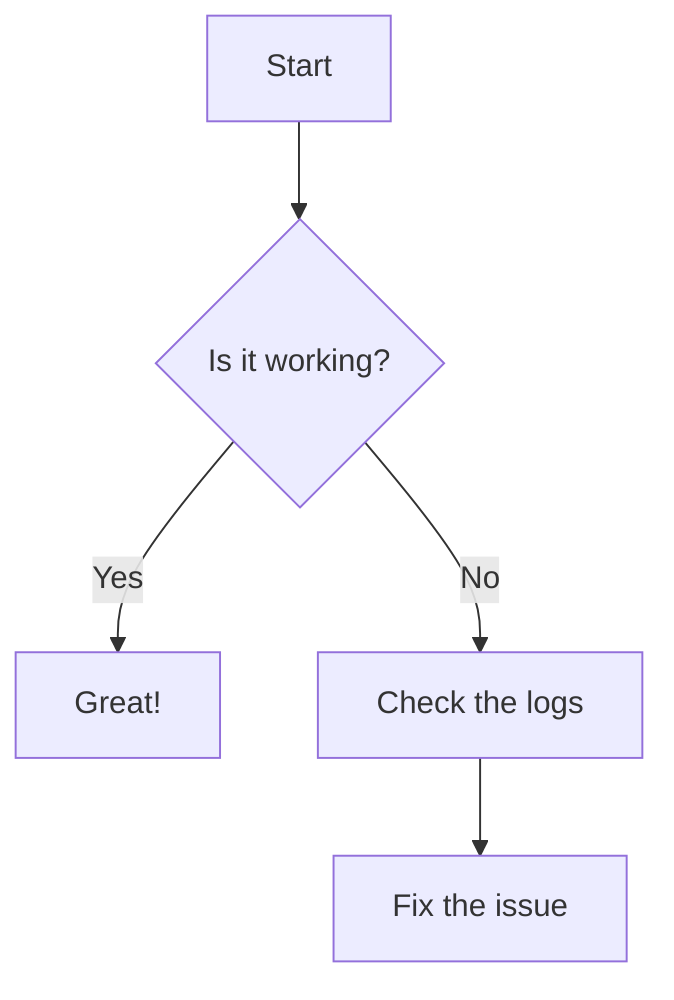
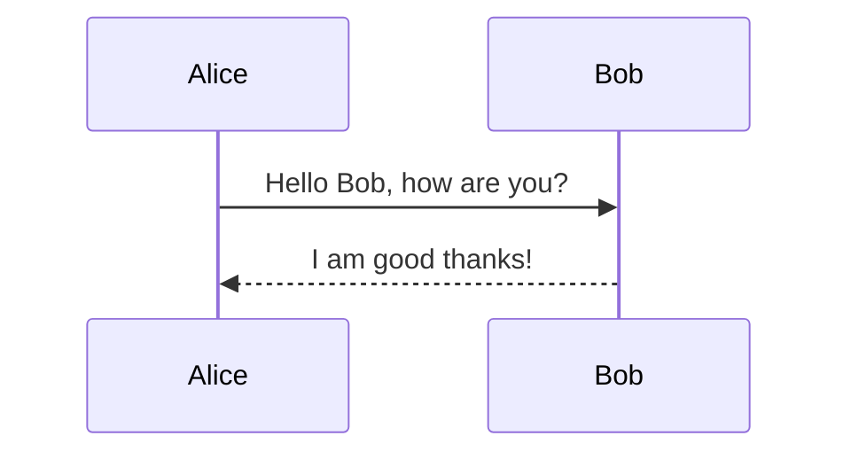
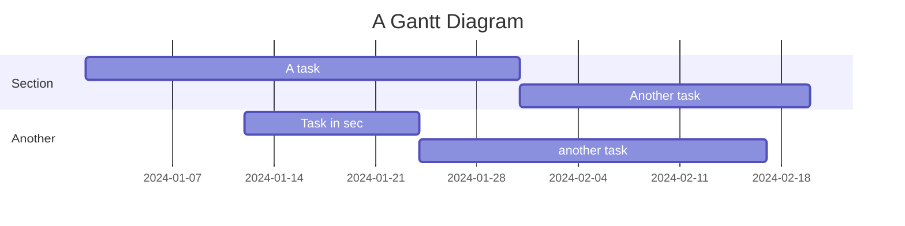

# Code & callouts

## Syntax highlighting

The theme bundles custom Highlight.js grammars (notably **GLSL** and
**Dockerfile**). Each block below should be coloured, not plain.

C++ (the engine's home turf):

```cpp
#include <span>
#include <cstdint>

namespace liara::render {

/// A contiguous, non-owning view over draw commands.
[[nodiscard]] constexpr std::size_t count(std::span<const std::uint32_t> cmds) noexcept {
    return cmds.size();
}

} // namespace liara::render
```

GLSL:

```glsl
#version 450
layout(location = 0) in vec3 inNormal;
layout(location = 0) out vec4 outColor;

void main() {
    float ndl = max(dot(normalize(inNormal), vec3(0.0, 1.0, 0.0)), 0.0);
    outColor = vec4(vec3(ndl), 1.0);
}
```

Dockerfile:

```dockerfile
FROM debian:bookworm-slim
RUN apt-get update && apt-get install -y --no-install-recommends graphviz
ENTRYPOINT ["build-docs"]
```

Diff:

```diff
- const int kMaxLights = 8;
+ constexpr int kMaxLights = 16;
```

Shell and JSON, for good measure:

```bash
docker run --rm -v "$PWD:/src" ghcr.io/liara-engine/liara-documentation-builder:latest
```

```json
{ "metadata": { "latest": "dev" }, "versions": { "dev": { "abi_compatibility": ["dev"] } } }
```

## Mermaid

Since v0.1.1, docs-shared supports Mermaid diagrams. The following should render as a flowchart, not a code block:



Also, a sequence diagram:



And a Gantt chart:



## Callouts

If docs-shared defines a callout convention (the semantic tokens cover
success / warning / danger / info), add one example of each here so a styling
regression on any of them is visible. As a baseline, plain blockquotes:

> **Note** — the periwinkle "info" tint should be distinguishable from the
> lavender brand secondary.

> **Success** — the mint "success" tint should not read as the lime-green

> **Warning** — the peach "warning" tint should not read as the danger rose-red.

> **Danger** — the rose-red "danger" tint should not read as the peach warning.