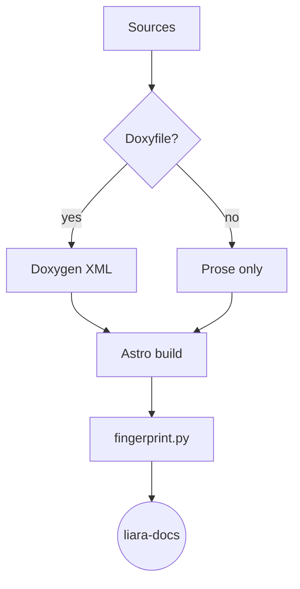
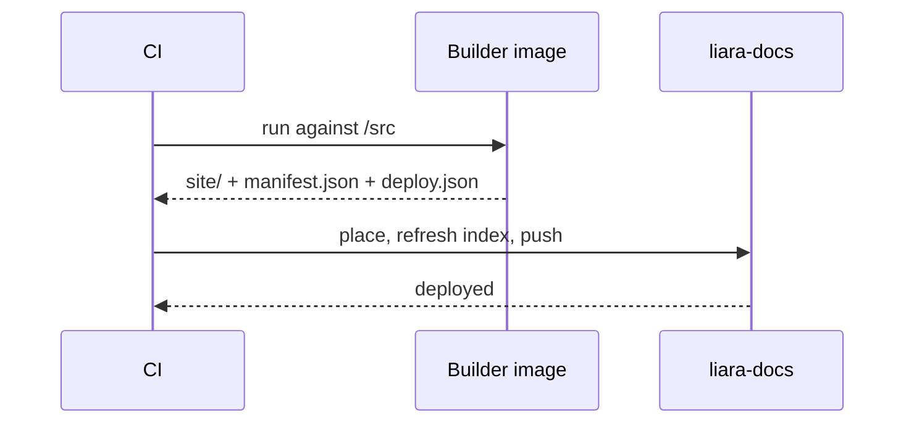
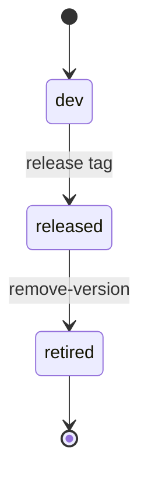
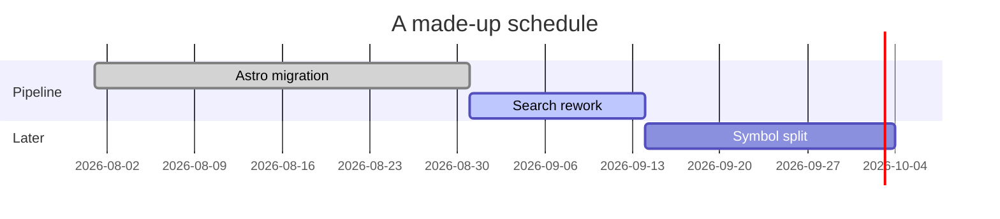

import { Aside } from '@astrojs/starlight/components';

Prose code fences go through Expressive Code; generated API signatures go through Shiki with a theme whose colours are `--liara-code-*` token references. Both have to look like the same language of code, in both themes.

## Frames

A fence with a `title` is rendered as a file:

```cpp title="include/liara/preview/ring_buffer.hpp"
#include <span>
#include <cstdint>

namespace liara::preview {

/// A contiguous, non-owning view over draw commands.
[[nodiscard]] constexpr std::size_t count(std::span<const std::uint32_t> cmds) noexcept {
    return cmds.size();
}

} // namespace liara::preview
```

A shell fence is rendered as a terminal:

```bash frame="terminal"
docker run --rm \
  -v "$PWD:/src" \
  -e LIARA_DOCS_REPO=docs-shared \
  -e LIARA_DOCS_VERSION=dev \
  ghcr.io/liara-engine/liara-documentation-builder:latest --output /src/generated-docs
```

`frame="none"` strips the chrome entirely:

```txt frame="none"
liara-core 0.2.3 · ABI 0.2.0 · COMPATIBLE
```

## Markers

Line highlights, insertions, deletions and collapsed regions:

```js title="astro.config.mjs" {6-9} ins={10} del={11} collapse={1-3}
import { defineConfig } from 'astro/config';
import starlight from '@astrojs/starlight';
import { liaraDocs } from '@liara/starlight-preset';

export default defineConfig(liaraDocs({
    starlight,
    repo: 'docs-shared',
    title: 'Docs-Shared Preview Fixtures',
    description: 'Synthetic module used to exercise the shared preset.',
    api: true,
    api: false,
}));
```

Word-level markers and line numbers:

```c showLineNumbers "liara_version_provides"
if (!liara_version_provides(&required, &available)) {
    return LIARA_RESULT_ABI_MISMATCH;
}
```

## Grammars

<Aside type="tip">
Every language the project actually writes should be tagged. An untagged fence
is a missed opportunity and, in a diff, a missed regression.
</Aside>

GLSL:

```glsl title="shaders/lambert.frag"
#version 450
layout(location = 0) in vec3 inNormal;
layout(location = 0) out vec4 outColor;

void main() {
    float ndl = max(dot(normalize(inNormal), vec3(0.0, 1.0, 0.0)), 0.0);
    outColor = vec4(vec3(ndl), 1.0);
}
```

Dockerfile:

```dockerfile
FROM debian:bookworm-slim
RUN apt-get update && apt-get install -y --no-install-recommends graphviz
ENTRYPOINT ["build-docs"]
```

CMake:

```cmake
add_library(liara_preview INTERFACE)
target_include_directories(liara_preview INTERFACE include)
target_compile_features(liara_preview INTERFACE cxx_std_20)
```

Diff:

```diff
- const int kMaxLights = 8;
+ constexpr int kMaxLights = 16;
```

JSON, YAML and INI, the three configuration formats in the pipeline:

```json title="manifest.json"
{
  "manifest_version": 2,
  "kind": "infrastructure",
  "metadata": { "name": "Docs-Shared Preview Fixtures", "latest": "dev" },
  "versions": { "dev": {} }
}
```

```yaml title=".github/workflows/docs.yml"
jobs:
  docs:
    uses: liara-engine/.github/.github/workflows/reusable-docs.yml@v2
    with:
      image: ghcr.io/liara-engine/liara-documentation-builder:latest
```

```ini title="Doxyfile"
INPUT       = include
RECURSIVE   = YES
EXTRACT_ALL = YES
```

Python, for the site tools:

```python title="tools/search-index.py"
def build_glob(targets: list[Target]) -> str:
    paths = sorted(target.path for target in targets)
    prefix = paths[0] if len(paths) == 1 else "{" + ",".join(paths) + "}"
    return f"{prefix}/**/*.html"
```

## Diagrams

A `mermaid` fence renders as an SVG that follows the active theme. Switching
themes must re-render it, not leave the previous palette behind.

Flowchart:



Sequence:



State:



Gantt:



## Callouts against the semantic tokens

The four aside types map onto the four semantic token families, and each must
stay distinguishable from its neighbour:

:::note
Periwinkle *info*. Must not read as the lavender brand secondary.
:::

:::tip
Mint *success*. Must not read as lime green.
:::

:::caution
Peach *warning*. Must not read as the rose-red danger.
:::

:::danger
Rose-red *danger*. Must not read as the peach warning.
:::
